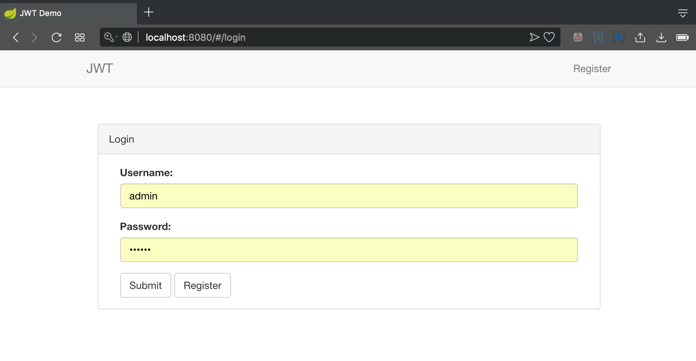
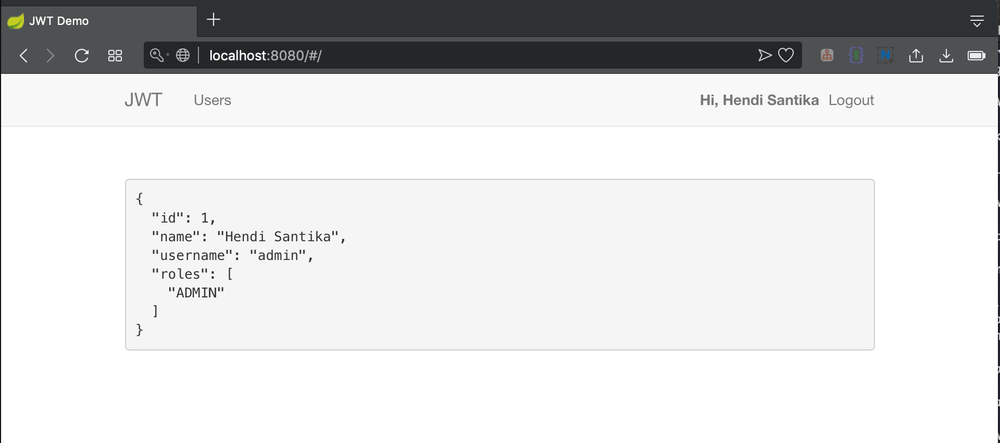
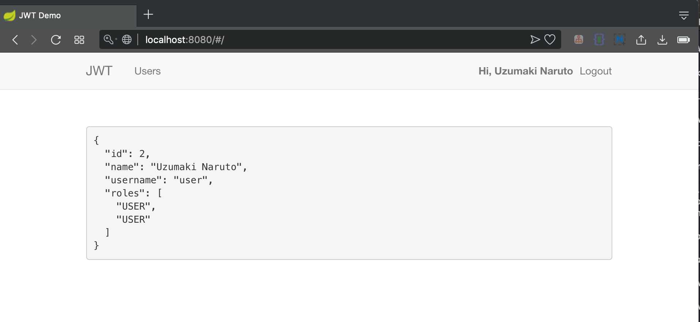
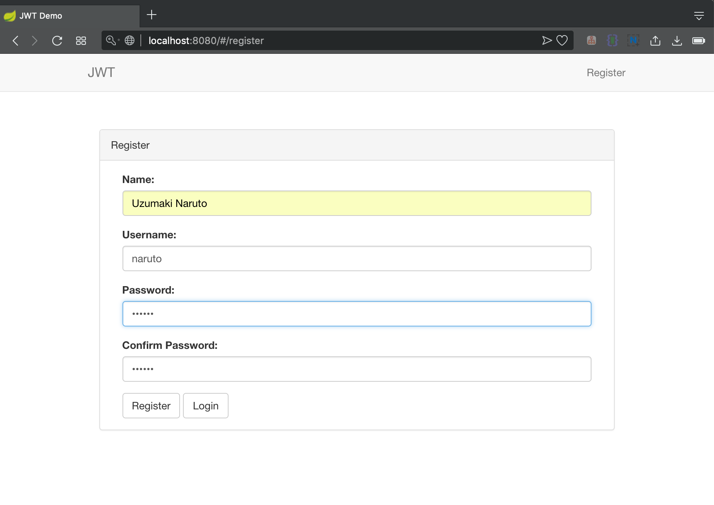

# Spring Boot Security JWT AngularJS

Open your terminal then type this : `mvn clean spring-boot:run`

Open your browser then type this : `http://localhost:8080/`

### Screenshot

Login Admin

Admin Page

Login User

Register User

